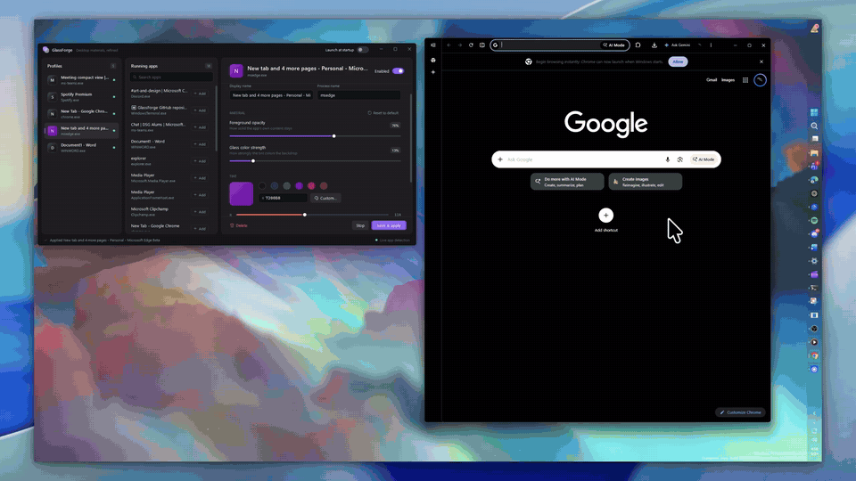
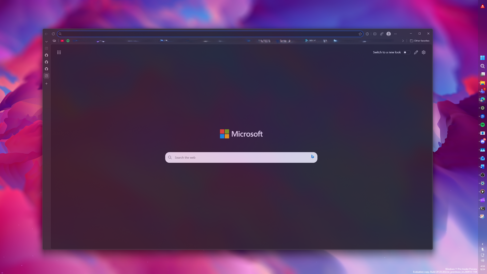
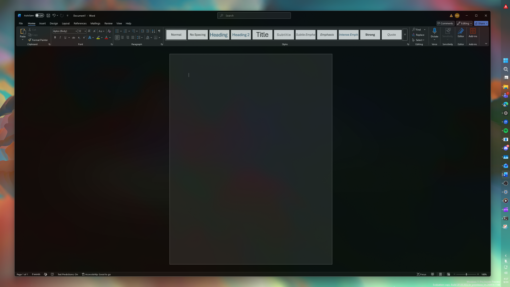
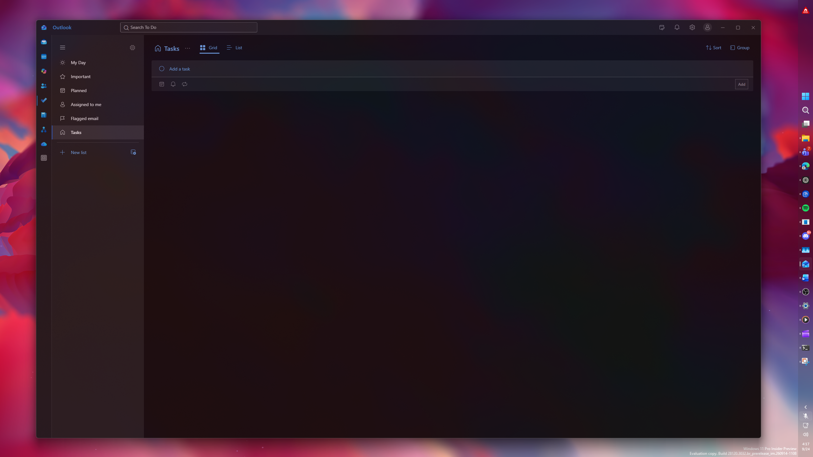
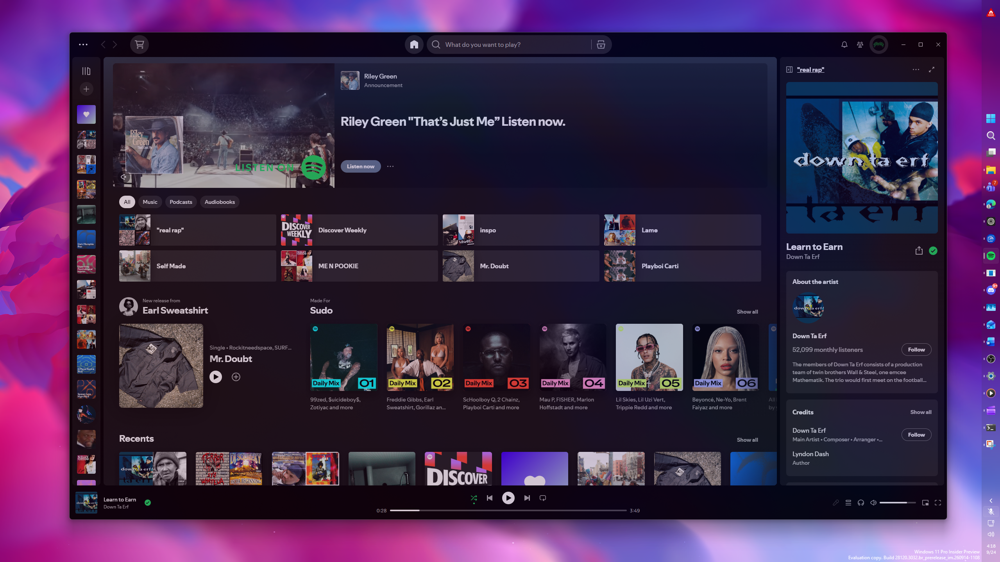

# GlassForge

GlassForge is a Windows desktop tool that applies a configurable frosted-glass backdrop to Microsoft and third-party applications without modifying their binaries. Users select a running application, create a process-restricted profile, and tune window opacity, tint strength, and tint color.

The current foundation is based on working Teams, Outlook, and Word PowerShell prototypes, but the product code is native C#.

> **Public beta — contributors and testers wanted.** GlassForge works day to day, but it needs broader coverage across apps, Windows builds, GPUs, and multi-monitor/DPI setups. See [Get involved](#get-involved).


## Download

**[ Download the latest GlassForge.exe](../../releases/latest)** — one self-contained file for Windows 10/11 x64. No installer and no .NET install required. GlassForge is open source under the MIT license, so you can also build it yourself (see [Build and run](#build-and-run)).

The beta isn't code-signed yet, so Windows SmartScreen may warn you the first time. Click **More info → Run anyway**.

**Updating:** just run the new `GlassForge.exe`. It closes any older copy that's still running, restores that copy's windows, and takes over its launch-at-startup entry.

## Screenshots

Tune tint color and opacity live, with changes applied to the target app instantly:



| Microsoft Edge | Microsoft Word |
|---|---|
|  |  |
| **Outlook (To Do)** | **Spotify** |
|  |  |

## Current capabilities

- Discover visible desktop applications.
- Create profiles for any process, including apps that report no `MainWindowHandle`.
- Apply background acrylic through a dedicated native host window.
- Keep application text, icons, and controls on the sharp foreground layer.
- Track movement with WinEvent hooks and DPI-correct native coordinates.
- Restore backdrop Z-order immediately when a target regains focus.
- Persist profiles as JSON under `%LOCALAPPDATA%\GlassForge`.
- Run multiple independent profiles.
- Minimize to the notification area.
- Start silently with Windows through the current-user Run key.
- Go solid automatically while a target is fullscreen (video, games, slideshows).
- Optionally go solid while the target app plays media, per profile ("Pause while media plays").
- Allow only one running instance, and restore any windows left translucent by a crash on the next launch.

## Requirements

- Windows 11 is recommended.
- Nothing extra for normal use; the release `.exe` bundles the .NET runtime.
- .NET 8 SDK for development.
- The target app and GlassForge should run at the same integrity level.

## Build and run

```powershell
dotnet build GlassForge.sln
dotnet run --project src\GlassForge.App
```

Run the UI without starting configured effects:

```powershell
dotnet run --project src\GlassForge.App -- --no-effects
```

Run smoke tests:

```powershell
dotnet run --project tests\GlassForge.Tests
```

## Repository layout

```text
src/GlassForge.App/
  Models/       Persistent application profiles
  Native/       Win32 and DWM interop declarations
  Services/     Discovery, persistence, startup, and glass-host engine
  App.xaml      Application lifecycle and background mode
  MainWindow.*  Profile management UI and tray integration
tests/GlassForge.Tests/
  Dependency-free foundation smoke tests
```

## Documentation

- [User guide](docs/USER_GUIDE.md)
- [Software architecture](docs/ARCHITECTURE.md)
- [PowerShell prototype migration](docs/SCRIPT_MIGRATION.md)

## Architecture

Each enabled profile owns an isolated STA host thread. The host finds the largest visible top-level window owned by the configured process, applies layered opacity to the target, and positions a non-activating acrylic surface directly behind it. Target discovery is throttled; movement and focus changes use WinEvent callbacks. Frame coordinates are cached so stationary windows produce no compositor repositioning work.

This design is broadly compatible with Win32, WebView2, Chromium, and Office applications. Because the acrylic surface is a separate HWND, a small compositor-frame delay can remain during rapid dragging. A future injected or in-process composition backend could remove that limitation for applications that expose a supported extension point.

## Roadmap

- Multiple-window support per process.
- Presets and import/export.
- Per-monitor and per-state tuning.
- Material choices: neutral acrylic, colored acrylic, Mica, and blur-behind.
- Signed installer and automatic updates.
- Accessibility and high-contrast validation.
- Crash recovery, structured logging, and diagnostics export.
- Optional supported in-process backends for applications with extension APIs.
- Automated UI and native-window integration tests.

## Get involved

**Testers:** build and run GlassForge, point it at the apps you use, and [open an issue](../../issues/new/choose) using the bug report template. The most useful reports include the target app and version, your Windows build, your monitor/DPI setup, and a screenshot or short clip.

**Developers:** read [CONTRIBUTING.md](CONTRIBUTING.md) and [the architecture doc](docs/ARCHITECTURE.md), then pick anything from the roadmap or the issue tracker. Please open an issue before starting large changes.

## Safety model

GlassForge targets windows by owning process ID. It does not inject code, patch application files, read application content, or require administrator privileges for ordinary applications.

## License

MIT. See `LICENSE`.
